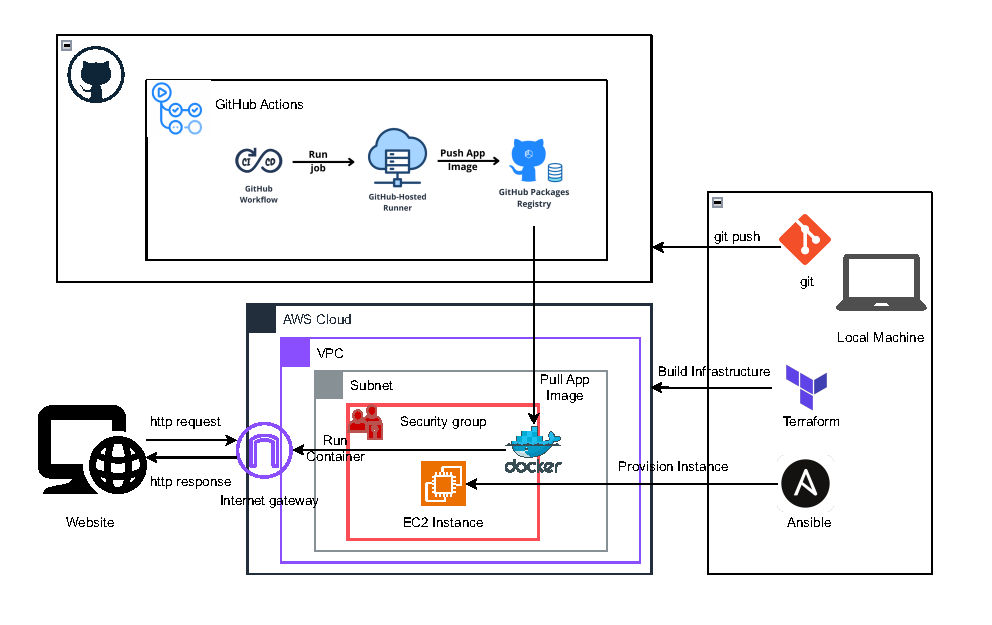

# AWS Infrastructure CI/CD Automation

This repository contains all the necessary files and configurations to automate the provisioning, configuration, and deployment of a web application on AWS using **Terraform**, **Ansible**, **Docker**, and **GitHub Actions**.

---

## **Overview**

This project automates the deployment of a containerized web application in the following steps:
1. **Provision Infrastructure**: Use **Terraform** to provision an AWS EC2 instance, VPC, subnet, and security groups.
2. **Configure the Instance**: Use **Ansible** to install Docker on the EC2 instance, pull the application image from GitHub Packages, and run the application as a container.
3. **CI/CD Pipeline**: Use **GitHub Actions** to build the Docker image, push it to GitHub Packages, and trigger the deployment process.

---

## **Architecture**

The architecture for this project includes the following components:
- **Local Development Environment**: Tools like Git, Terraform, Ansible, and Docker are used for development and testing.
- **AWS Infrastructure**: Resources like VPC, Subnet, Security Group, and EC2 instance are provisioned via Terraform.
- **Containerization**: Docker is used to package the web application.
- **CI/CD Automation**: GitHub Actions automate Docker image builds and deployment workflows.

  

---

## **Getting Started**

### **Prerequisites**
Make sure you have the following installed:
- **Terraform**: [Terraform](https://www.terraform.io/)
- **Ansible**: [Ansible](https://www.ansible.com/)
- **Docker**: [Docker](https://www.docker.com/)
- **Git**: [Git](https://git-scm.com/)

You’ll also need:
- An AWS account with programmatic access (Access Key ID and Secret Access Key).
- A GitHub account to store the repository and configure workflows.

---

## **Setup Instructions**

### **Step 1: Clone the Repository**
```bash
git clone https://github.com/AzizSouissi/aws-infra-ci-cd.git
cd aws-infra-ci-cd
```

### **Step 2: Configure Terraform**
1. Navigate to the `terraform/` directory:
   ```bash
   cd terraform
   ```
2. Initialize Terraform:
   ```bash
   terraform init
   ```
3. Apply Terraform configurations:
   ```bash
   terraform apply
   ```
   This will provision AWS resources like VPC, Subnet, Security Group, and EC2 instance.

### **Step 3: Configure Ansible**
1. Navigate to the `ansible/` directory:
   ```bash
   cd ansible
   ```
2. Update the inventory file with the public IP of your EC2 instance.
3. Run the playbook to configure the EC2 instance:
   ```bash
   ansible-playbook main.yml
   ```

### **Step 4: CI/CD Pipeline**
1. Commit and push changes to the GitHub repository.
2. GitHub Actions will automatically trigger the CI/CD workflow:
   - Build the Docker image.
   - Push the image to GitHub Packages.
   - Deploy the application on the provisioned EC2 instance.

---

## **License**
This project is licensed under the [MIT License](LICENSE).  
You are free to use, modify, and distribute this software, provided that proper attribution is given.
